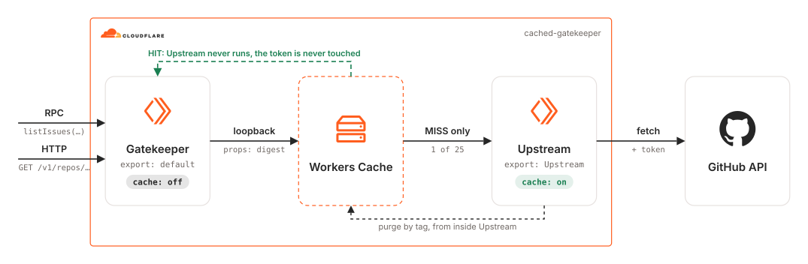
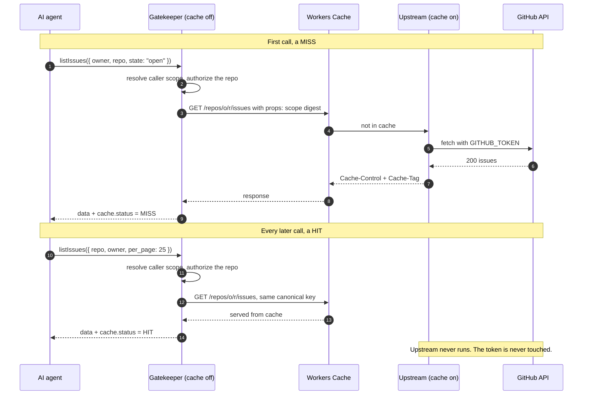
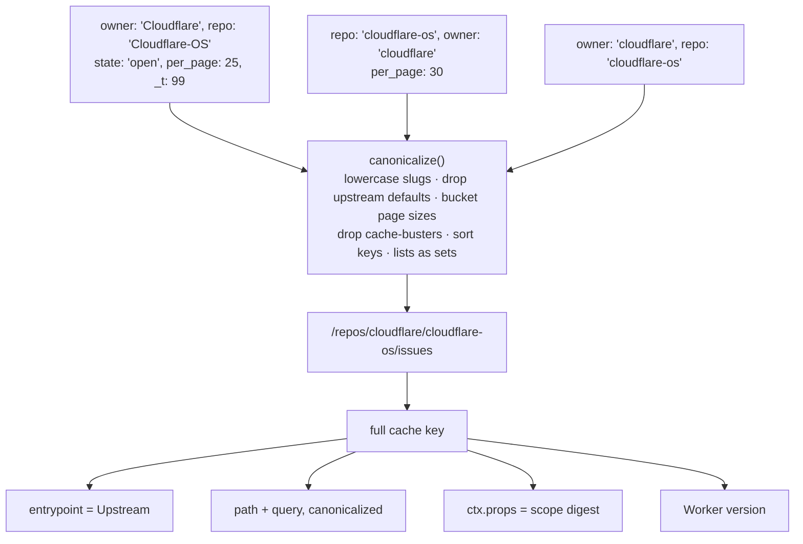
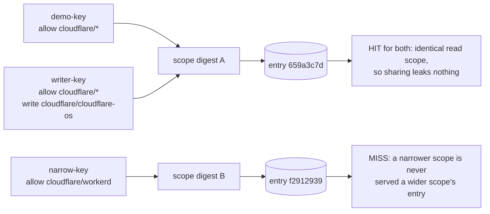
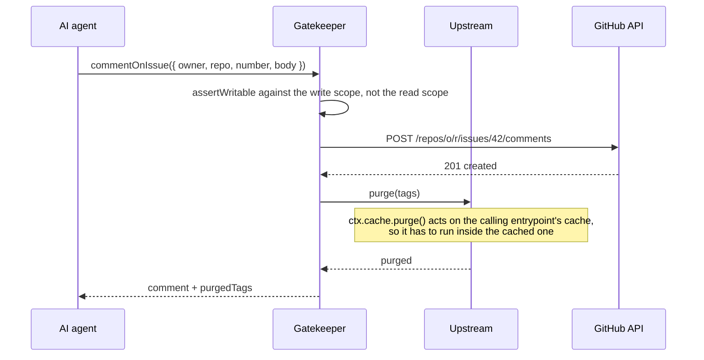

# cdktn-cached-gatekeeper

CDKTN app that deploys a [Cloudflare OS](https://github.com/cloudflare/cloudflare-os) style Gatekeeper with [Workers Cache](https://developers.cloudflare.com/workers/cache/) underneath its capability bindings, so an agent can ask the same question two hundred times in a couple of minutes and GitHub is asked twice.

## Architecture Diagram

<picture>
  <source media="(prefers-color-scheme: dark)" srcset="./src/assets/arch-diagram-dark.svg">
  
</picture>

## Prerequisites

- **_Cloudflare:_**
  - Must have set the `CLOUDFLARE_API_TOKEN` variable in your local environment, with the `Workers Scripts:Edit` and `Account Settings:Read` permissions.
- **_mise:_**
  - [Install mise](https://mise.jdx.dev/installing-mise.html), which manages Node, pnpm, and OpenTofu.

## Installation

```sh
mise install
pnpm install
pnpm gen
```

`pnpm gen` generates the Cloudflare provider constructs into `.gen/`. Re-run it whenever the provider constraint in `cdktf.json` changes.

## Deployment

```sh
pnpm run deploy
```

Creates one Worker, `cached-gatekeeper`, and enables its `workers.dev` subdomain. Takes a few seconds.

> [!TIP]
> Leaving `GITHUB_TOKEN` unset is the more interesting demo. The anonymous GitHub API allows 60 requests an hour, so you can watch a workload that would otherwise be dead in a minute keep working.

To deploy with a token:

```sh
pnpm run deploy -- --var githubtoken="$GITHUB_TOKEN"
```

## Usage

1. Grab the `workers.dev` URL of `cached-gatekeeper` from the Cloudflare dashboard.

2. Open it in a browser and press **Run**. The explorer fires the same capability call repeatedly and shows `Cf-Cache-Status` alongside `origin id`, a value the credentialed entrypoint stamps only when it actually executes. Once the id stops changing, the cache is answering, and the GitHub rate-limit budget stops falling with it.

3. For a measured rather than eyeballed number:

   ```sh
   pnpm bench --url https://cached-gatekeeper.<SUBDOMAIN>.workers.dev -n 20
   ```

   It counts distinct `originId` values, so the hit rate is observed rather than inferred. Measured against this Worker on the Free plan, no GitHub token, 25 calls to `listPullRequests`:

   <details>
   <summary>Benchmark output</summary>

   ```
     calls           25
     reached GitHub  1
     cache hits      24  (96.0%)
     upstream spend  1 GitHub request(s)
     quota left      19
     hit  p50/p95    61ms / 72ms
     miss p50/p95    696ms / 696ms
     cf-cache-status MISS=1 HIT=24
   ```

   </details>

   The hit latency is almost entirely client-to-edge round trip; the Worker itself does no work on a hit.

Workers Cache works on `workers.dev` exactly as it does on a custom domain, because the cache belongs to the Worker rather than to a zone, so there is nothing else to buy or configure.

### Local development

```sh
cp .dev.vars.example .dev.vars
pnpm dev
```

> [!NOTE]
> `wrangler dev` does not apply Workers Cache. Everything else works locally; the caching only shows up once deployed.

Every call reaches GitHub, `Cf-Cache-Status` is absent, and the explorer says so rather than pretending otherwise. Local dev is for the gatekeeper's logic: canonicalization, scopes, routing.

## Cleanup

```sh
pnpm destroy
```

Removes the Worker and its subdomain. Nothing else is created, so there is no other state to clean up.

## The problem

Cloudflare OS's security model is the **Gatekeeper**: a Worker that holds a service's credentials and hands agents a *typed capability* instead of a token. The agent writes this, and never sees an API key:

```ts
const issues = await env.PROJECT.listIssues({ teamId: "ENG", state: "open" });
```

That is RPC. And [Workers Cache does not cache RPC](https://developers.cloudflare.com/workers/cache/limitations/):

> Only `fetch()` invocations on a WorkerEntrypoint go through Workers Caching. Custom RPC methods like `ctx.exports.Backend.getUser(id)` bypass the cache.

So the two do not compose. A gatekeeper written the obvious way, as a class with methods on it, cannot be cached, and every agent that re-reads the same issue pays full upstream latency and burns a rate limit shared by everyone in the organization. That bites harder here than on a website, because agents repeat themselves constantly: one triage session re-reads the same issue list on almost every turn.

## The fix

Keep the RPC surface for the agent. Route each method through an internal HTTP call to a *second* entrypoint, and cache that.



Caching is configured per entrypoint, which is what makes this expressible at all: in `wrangler.jsonc` for `pnpm dev`, and in the Terraform stack for the deployed Worker:

```ts
cacheOptions: { enabled: false },
exports: {
  default:  { type: "worker", cache: { enabled: false } },
  Upstream: { type: "worker", cache: { enabled: true } },
},
```

`cdktf.json` pins `cloudflare/cloudflare@~> 5.23.0`; `cache_options` and per-entrypoint `exports` do not exist in earlier providers, which matters if you lift this into an existing stack.

The gateway is never cached, so **every call is authorized, including the ones that hit**. The `Upstream` entrypoint has no route and no service binding, so it is reachable only through `ctx.exports`, which is precisely the hop the cache sits on. On a hit, the entrypoint holding the GitHub credential does not execute at all.

## The four things that make it actually work

### 1. Canonicalization, because agents don't repeat themselves byte-for-byte

A browser emits identical requests for the same page. A model emits a different argument object every time it asks the same question: keys in a different order, `state: "open"` sometimes spelled out and sometimes defaulted, `per_page: 25` one turn and `30` the next, and a `_t` parameter it invented to "avoid stale data". Cached naively these are all distinct entries, and the hit rate collapses to roughly zero at the exact moment the cache would have paid off.

[`src/worker/cache-key.ts`](src/worker/cache-key.ts) reduces every call to a canonical form: sorted keys, list values treated as sets, page sizes snapped to buckets, upstream defaults collapsed onto the omitted form, cache-busting parameters dropped, owner and repo lowercased. Each of those is a separate test case, because each is a real hit-rate cliff.

The canonical key is deliberately *a valid GitHub REST path*, and it is used as the loopback request's URL:

What actually composes the key:



Because the key *is* the path that gets fetched, the two cannot drift apart, and a drifted cache serves one resource under another's key. It also means `cf.cacheKey` is never needed, which matters here: that override is Enterprise-gated.

### 2. Keying on the permission, not the person

The cache key includes `ctx.props`, which is how a shared cache stays tenant-safe. The obvious thing to put there is the user id, which is correct and nearly useless: a hundred engineers with identical read access generate a hundred copies of every response.

So [`src/worker/policy.ts`](src/worker/policy.ts) puts a digest of the caller's **scope**, the set of repositories they may read, in `ctx.props` instead. Two callers with the same scope cannot receive anything the other wasn't already entitled to, so they can safely share an entry. Two callers with different scopes never touch the same key. Authorization stays per-caller; the cache partitions per-permission.



One consequence worth knowing: the loopback request is a bare `GET` with no inherited headers. Workers Cache bypasses any request carrying `Authorization` or `Cookie`. That is the right default for a public cache and exactly wrong here, since authorization was already decided upstream of that hop and is represented by the scope digest.

### 3. Invalidation has to run inside the cached entrypoint

Every response is tagged (`repo:o/r`, `issues:o/r`, `issue:o/r#123`), and writes purge the tags covering what they changed. But `ctx.cache.purge()` acts on the *calling* entrypoint's cache, and the gateway deliberately has none, so purging from the gateway would silently do nothing while appearing to succeed. The purge is therefore an RPC method on `Upstream`:

```ts
await this.ctx.exports.Upstream.purge(["issue:cloudflare/workerd#42", "issues:cloudflare/workerd"]);
```



Reaching it over RPC is fine, because RPC isn't cached and a purge should never be cached. Without this, an agent comments on an issue and then reads back a version of that issue without its own comment: the most confusing thing a cached agent tool can do.

### 4. Freshness tuned for an agent, not a browser

`stale-while-revalidate` does most of the latency work: the agent gets an answer immediately and the refresh happens out of band. This is also a concrete reason to use Workers Cache rather than the older `caches.default` API, which [ignores that directive entirely](https://developers.cloudflare.com/workers/runtime-apis/cache/). 404s get a short negative cache, because agents guess file paths constantly. Rate-limit and auth failures are never cached, because caching a 403 turns a transient upstream problem into a sticky one for everyone sharing the scope.

## The capability surface

| Method | HTTP | Fresh for | Stale-serve |
| --- | --- | ---: | ---: |
| `getRepo` | `GET /v1/repos/:owner/:repo` | 300s | 1h |
| `listIssues` | `GET /v1/repos/:owner/:repo/issues` | 60s | 10m |
| `getIssue` | `GET /v1/repos/:owner/:repo/issues/:n` | 30s | 5m |
| `listPullRequests` | `GET /v1/repos/:owner/:repo/pulls` | 60s | 10m |
| `getFile` | `GET /v1/repos/:owner/:repo/contents/*` | 300s | 24h |
| `searchIssues` | `GET /v1/search/issues?q=` | 120s | 10m |
| `commentOnIssue` | `POST /v1/repos/:owner/:repo/issues/:n/comments` | n/a | purges |
| `invalidate` | n/a | n/a | purges |

Every read returns its data alongside cache metadata:

```json
{
  "data": [],
  "cache": {
    "key": "/repos/cloudflare/cloudflare-os/issues?state=closed",
    "originId": "0d9c…",
    "status": "HIT",
    "ageMs": 41200,
    "servedFromCache": true,
    "upstreamRateLimitRemaining": 4987
  }
}
```

Policy is a JSON variable mapping a caller credential to a scope. `write` is deliberately separate from `allow`, because reading a backlog should not imply being able to comment on it:

```json
{
  "triage-agent": { "subject": "triage", "allow": ["cloudflare/*"], "write": ["cloudflare/workerd"] },
  "readonly-agent": { "subject": "docs", "allow": ["cloudflare/cloudflare-docs"] }
}
```

The stack ships three demo credentials (`demo-key`, `writer-key` and `narrow-key`) chosen so the sharing and partitioning behaviour above can be reproduced directly.

## Verified behaviour

Measured against the deployed Worker, not asserted from the design.

**The cache answers, and the credential never runs.** Six identical calls; `originId` is stamped only when the credentialed entrypoint actually executes, and GitHub's remaining quota is frozen after the first.

<details>
<summary>Run output</summary>

```
n=1  MISS  origin=a350deab  quota=47
n=2  HIT   origin=a350deab  quota=47
n=3  HIT   origin=a350deab  quota=47
...
```

</details>

**Canonicalization collapses agent variance.** Four differently-spelled calls, one cache entry, and a semantically different call correctly misses.

<details>
<summary>Run output</summary>

```
?state=open&per_page=30        MISS  origin=9af2b924  key=/repos/cloudflare/cloudflare-os/issues
Cloudflare/Cloudflare-OS ...   HIT   origin=9af2b924  key=/repos/cloudflare/cloudflare-os/issues
?per_page=25                   HIT   origin=9af2b924  key=/repos/cloudflare/cloudflare-os/issues
?per_page=12&state=open&_t=99  HIT   origin=9af2b924  key=/repos/cloudflare/cloudflare-os/issues
?state=closed                  MISS  origin=a91bb0c8  key=/repos/cloudflare/cloudflare-os/issues?state=closed
```

</details>

**The cache partitions by permission, not by caller.** All three read the same URL:

| credential | read scope | result |
| --- | --- | --- |
| `demo-key` | `cloudflare/*` | MISS, then HIT, populating entry `659a3c7d` |
| `writer-key` | `cloudflare/*` (plus a write grant) | HIT on `659a3c7d`, same scope, so sharing is safe |
| `narrow-key` | `cloudflare/workerd` | **MISS**, own entry `f2912939`, because a narrower scope is never served a wider scope's entry |

The write grant does not partition, because it does not widen what the caller may observe.

One incidental finding: anonymous GitHub quota is per egress IP, so the remaining count differs between cache entries filled from different Cloudflare colos. It is a useful signal, not a precise budget.

## Using it from Cloudflare OS

The default entrypoint is already the shape a Gatekeeper needs: typed methods, no credential exposure, authorization before every fetch. Bind it as a service on the Workshop and identity arrives as `ctx.props.credential` instead of a bearer header. `scopeFor()` accepts either.

Cloudflare OS is early access and moving, so this project does not take a hard dependency on its internal Gatekeeper contract (`GatekeeperVendor`, sessions, observations). It stands alone and deploys on its own; wiring it into a deployment is the [starter repo's](https://github.com/cloudflare/cloudflare-os-starter/blob/main/docs/customization.md) `packages/` flow.

## Known rough edges

> [!WARNING]
> Both credentials are `secret_text` bindings driven by Terraform variables, so their values land in the Terraform state file. Keep the state private, or drop the bindings and manage them with `wrangler secret put` instead.

- Each Worker version gets its own cache unless `cross_version_cache` is set, so every redeploy starts cold. That is the right default, but it does mean a redeploy in the middle of a measurement resets the hit rate.
- `wrangler.jsonc` and the stack are two sources of truth: wrangler builds the bundle and drives `pnpm dev`, Terraform deploys it. A test asserts the cache configuration in the two agrees, because a drift there means local and deployed behaviour disagree about what is cached.

## References

- [Cloudflare OS: an open platform for agents, apps, and work](https://blog.cloudflare.com/cloudflare-os/)
- [Your Worker can now have its own cache in front of it](https://blog.cloudflare.com/workers-cache/)
- [Workers Cache docs](https://developers.cloudflare.com/workers/cache/): [cache keys](https://developers.cloudflare.com/workers/cache/cache-keys/), [limitations](https://developers.cloudflare.com/workers/cache/limitations/), [debugging](https://developers.cloudflare.com/workers/cache/debugging/)
- [Cache API (`caches.default`)](https://developers.cloudflare.com/workers/runtime-apis/cache/), the older API this deliberately does not use
- [`ctx.exports` loopback bindings](https://developers.cloudflare.com/changelog/2025-09-26-ctx-exports/)
- [Agents on Cloudflare](https://blog.cloudflare.com/agents-on-cloudflare/)
