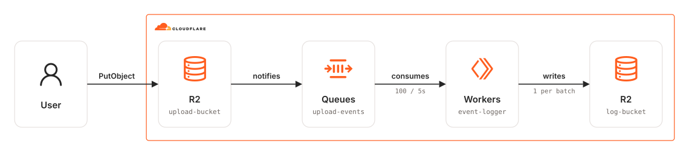

# cdktn-upload-events-logger

CDKTN app that generates a log upon uploading a file to an R2 bucket.

### Related Apps

- [wrangler/upload-events-logger](../../wrangler/upload-events-logger) - Built with Wrangler instead of CDKTN.

## Architecture Diagram

<picture>
  <source media="(prefers-color-scheme: dark)" srcset="./src/assets/arch-diagram-dark.svg">
  
</picture>

## Prerequisites

- **_Cloudflare:_**
  - Must have set the `CLOUDFLARE_API_TOKEN` variable in your local environment, with the `Workers Scripts:Edit`, `Queues:Edit`, `Workers R2 Storage:Edit` and `Account Settings:Read` permissions.
- **_mise:_**
  - [Install mise](https://mise.jdx.dev/installing-mise.html), which manages Node, pnpm, and OpenTofu.

## Installation

```sh
mise install
pnpm install
pnpm gen
```

`pnpm gen` generates the Cloudflare provider constructs into `.gen/`. Re-run it whenever the provider constraint in `cdktf.json` changes.

## Deployment

```sh
pnpm run deploy
```

## Cleanup

```sh
pnpm destroy
```

## How it works

A `PutObject` on `upload-bucket` raises an R2 event notification onto `upload-events`. The `event-logger` Worker consumes that queue in batches of up to 100 messages (or every 5 seconds) and writes each batch to `log-bucket` as a single JSON file.

Wrangler owns the Worker **bundle**, CDKTN owns the **deployment**:

1. `pnpm bundle` runs `wrangler deploy --dry-run --outdir dist`, which bundles `src/worker/index.ts`.
2. `src/stacks/my-stack.ts` picks up `dist/index.js` as a `TerraformAsset` and uploads it through `cloudflare_workers_script` (`content_file` + `content_sha256`), with the `LOG_BUCKET` binding and the queue consumer declared in Terraform.

`pnpm synth`, `pnpm diff`, `pnpm run deploy`, and `pnpm test` all run the bundle step first, so the synthesized stack always matches the current source. The stack reads `dist/index.js` while it is being constructed, so nothing that instantiates it works without a bundle.

Keep the compatibility date, compatibility flags, and bindings in `wrangler.jsonc` in sync with `src/stacks/my-stack.ts`. Wrangler needs them to bundle and to run locally, OpenTofu needs them to deploy.
