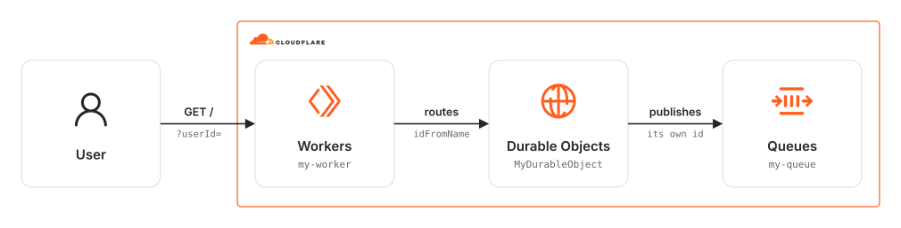

# wrangler-durable-objects-queue

Wrangler app that uses a Durable Object to publish messages to a queue.

### Related Apps

- [cdktn/durable-objects-queue](../../cdktn/durable-objects-queue) - Built with CDKTN instead of Wrangler.

## Architecture Diagram

<picture>
  <source media="(prefers-color-scheme: dark)" srcset="./src/assets/arch-diagram-dark.svg">
  
</picture>

## Prerequisites

- **_Cloudflare:_**
  - Must have set the `CLOUDFLARE_API_TOKEN` variable in your local environment, with the `Workers Scripts:Edit`, `Queues:Edit` and `Account Settings:Read` permissions.
- **_mise:_**
  - [Install mise](https://mise.jdx.dev/installing-mise.html), which manages Node and pnpm.

## Installation

```sh
mise install
pnpm install
```

## Deployment

Create queue:

```sh
pnpm wrangler queues create my-queue
```

Create worker:

```sh
pnpm run deploy
```

## Usage

1. Grab the `<WORKER_ROUTE_TRIGGER_URL>` from the deployment outputs:

   ```sh
   Published my-worker
     <WORKER_ROUTE_TRIGGER_URL>
     Producer for my-queue
   ```

2. Navigate to `https://my-worker.<SUBDOMAIN>.workers.dev?userId=test`.

3. Check that a message is present in `my-queue` from the Cloudflare dashboard.

## Cleanup

```sh
pnpm wrangler delete
```
