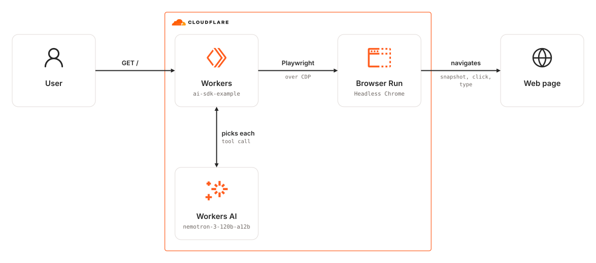

# wrangler-playwright-ai-sdk

Wrangler app in which a Workers AI model drives a Cloudflare Browser Run session through Playwright tools, deciding every step itself.

### Related Apps

- [wrangler/playwright-stagehand](../../wrangler/playwright-stagehand) - Scripts the steps with Stagehand instead of letting the model drive.
- [wrangler/playwright-claude-toolset](../../wrangler/playwright-claude-toolset) - Uses Claude's browser toolset and the paid Claude API instead of Workers AI.

## Architecture Diagram

<picture>
  <source media="(prefers-color-scheme: dark)" srcset="./src/assets/arch-diagram-dark.svg">
  
</picture>

## Prerequisites

- **_Cloudflare:_**
  - Must have set the `CLOUDFLARE_API_TOKEN` variable in your local environment, with the `Workers Scripts:Edit` and `Account Settings:Read` permissions.
- **_mise:_**
  - [Install mise](https://mise.jdx.dev/installing-mise.html), which manages Node and pnpm.

## Installation

```sh
mise install
pnpm install
```

## Deployment

```sh
pnpm run deploy
```

## Usage

Open the `workers.dev` URL from the deployment output. A `GET /` gives the model one task: open the [Playwright movies demo](https://debs-obrien.github.io/playwright-movies-app/), search for "Furiosa", open the result, and report the movie's details. The Worker answers with those details as JSON.

If the run fails, the Worker answers `502` with the reason as `{ "error": ... }` and still closes the browser.

## Cleanup

```sh
pnpm wrangler delete
```

## How it works

The model drives the workflow. The Worker gives it the whole task and a set of browser tools, and the [AI SDK](https://ai-sdk.dev/) runs the loop. On each step, the model picks one tool call, the Worker carries it out with Playwright, and the result goes back to the model. The run ends when the model calls `report_movie`, or after 20 steps.

`src/browserTools.ts` holds the tools, modeled on [Playwright MCP](https://github.com/microsoft/playwright-mcp)'s: `navigate`, `snapshot`, `click`, `type`, `press_key`, and `select_option`. They run inside the Worker rather than behind an MCP server. Each tool answers with Playwright's AI snapshot of the page: the accessibility tree that Playwright MCP serves, with a ref on each element for the next click or input. That method is private in Playwright (`page._snapshotForAI()`), so a Playwright upgrade can change it.

`report_movie` has no `execute` function. Its Zod schema checks the model's report, and the Worker returns that report as the response. `toolChoice: "required"` makes every step a tool call, so the model can't stop by replying in prose.

A Playwright route refuses every page-level navigation off `ALLOWED_HOSTS`, whether the model typed the URL, clicked a link, or followed a redirect. Images and API requests that the page makes itself are not checked.

The model is `@cf/nvidia/nemotron-3-120b-a12b`, which is available on the Workers Free plan and has a 256k token context for the page snapshots. Any Workers AI model with tool calling works; change `MODEL` in `src/index.ts`. Open models are less reliable than frontier models at multi-step browsing, so expect some runs to stop without a report.

Compared with `wrangler/playwright-stagehand`, this example isn't pinned to Stagehand 2.5 or Zod 3 and needs no adapter between Stagehand and Workers AI. It is model-driven: the model plans the steps, where the Stagehand example's code fixes them and asks the model only how to do each one. `wrangler/playwright-claude-toolset` uses the same model-driven approach with Claude's browser toolset and the paid Claude API.

On the Workers Free plan, Browser Run allows 10 minutes of browser time per day and one new browser every 20 seconds. Past either limit, runs fail with a `429` until the allowance resets.
