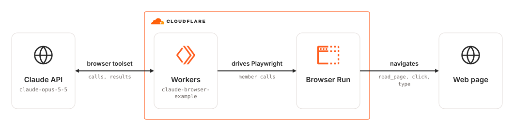

# wrangler-playwright-claude-browser

Wrangler app that lets Claude drive a Cloudflare Browser Run session through the Claude browser use toolset, with Playwright performing each browser action.

> [!NOTE]
> This example builds and typechecks but has not yet been run against a live deployment.

## Architecture Diagram

<picture>
  <source media="(prefers-color-scheme: dark)" srcset="./src/assets/arch-diagram-dark.svg">
  
</picture>

## Prerequisites

- **_Cloudflare:_**
  - Must have set the `CLOUDFLARE_API_TOKEN` variable in your local environment, with the `Workers Scripts:Edit` and `Account Settings:Read` permissions.
- **_Anthropic:_**
  - An Anthropic API key, stored as the Worker secret `ANTHROPIC_API_KEY`.
- **_mise:_**
  - [Install mise](https://mise.jdx.dev/installing-mise.html), which manages Node and pnpm.

## Installation

```sh
mise install
pnpm install
```

## Deployment

```sh
pnpm wrangler secret put ANTHROPIC_API_KEY
pnpm run deploy
```

## Usage

Open the `workers.dev` URL from the deployment output. A `GET /` gives Claude one task: open the [Playwright movies demo](https://debs-obrien.github.io/playwright-movies-app/), search for "Furiosa", open the result, and report the movie's details. The Worker answers with those details as JSON.

If the run fails, the Worker answers `502` with the reason as `{ "error": ... }` and still closes the browser.

## Cleanup

```sh
pnpm wrangler delete
```

## How it works

Claude's [browser use toolset](https://platform.claude.com/docs/en/agents-and-tools/tool-use/browser-use-tool) (`browser_toolset_20260801`) gives the model a fixed set of browser actions, such as `navigate`, `read_page`, `left_click`, and `type`. Claude chooses each action, and the caller performs it and returns the result. The Anthropic SDK's tool runner runs that loop. `src/playwrightBrowser.ts` is the driver: a subclass of the SDK's `BetaAbstractBrowserToolset20260801` that performs each action with Playwright on a Browser Run session. Actions the driver doesn't implement, such as `zoom`, drag, uploads, and `javascript_exec`, are offered to Claude as disabled.

Two checks keep Claude on the demo's host. The SDK runs a URL policy on every `navigate` call, and a Playwright route rejects any other main-frame navigation, such as a clicked link or a redirect, to a host outside `ALLOWED_HOSTS`. Images and API requests that the page makes itself are not checked.

`read_page` and `find` use Playwright's AI snapshot, the accessibility tree Playwright MCP serves, which tags each element with a ref that a later click or `form_input` can target. That method is private in Playwright (`page._snapshotForAI()`), so a Playwright upgrade can change it. `find` matches the query's words against snapshot lines rather than asking a model.

The final answer uses structured outputs, so Claude's last message is JSON that matches `MovieInfo`. The model is `claude-opus-5-5` at `medium` effort. If a safety classifier declines a request, `fallbacks: "default"` reruns it on a fallback model.

Unlike `wrangler/playwright-stagehand`, this example isn't pinned to Stagehand 2.5 or Zod 3, and it needs no adapter between Stagehand's model calls and Workers AI. The bundle is also about 40% smaller. In exchange, every run calls the paid Claude API instead of Workers AI.

On the Workers Free plan, Browser Run allows 10 minutes of browser time per day and one new browser every 20 seconds. Past either limit, runs fail with a `429` until the allowance resets.
