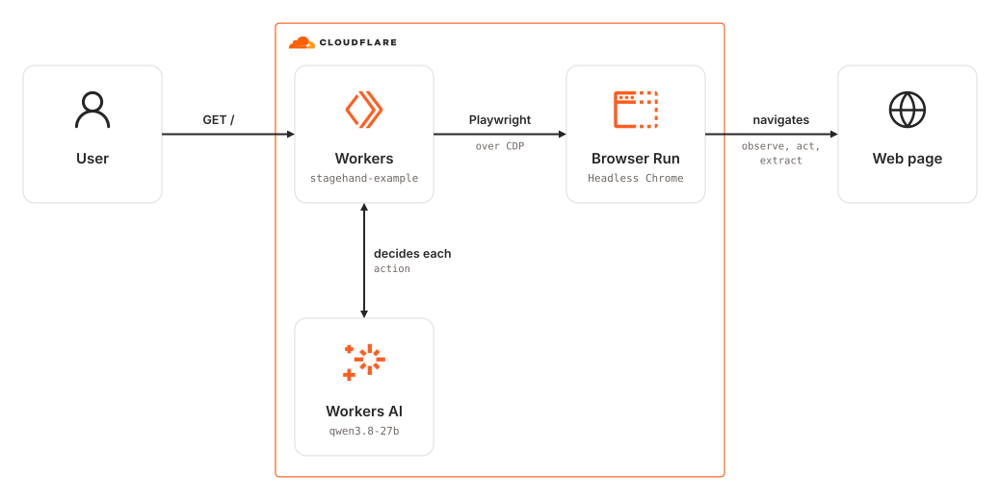
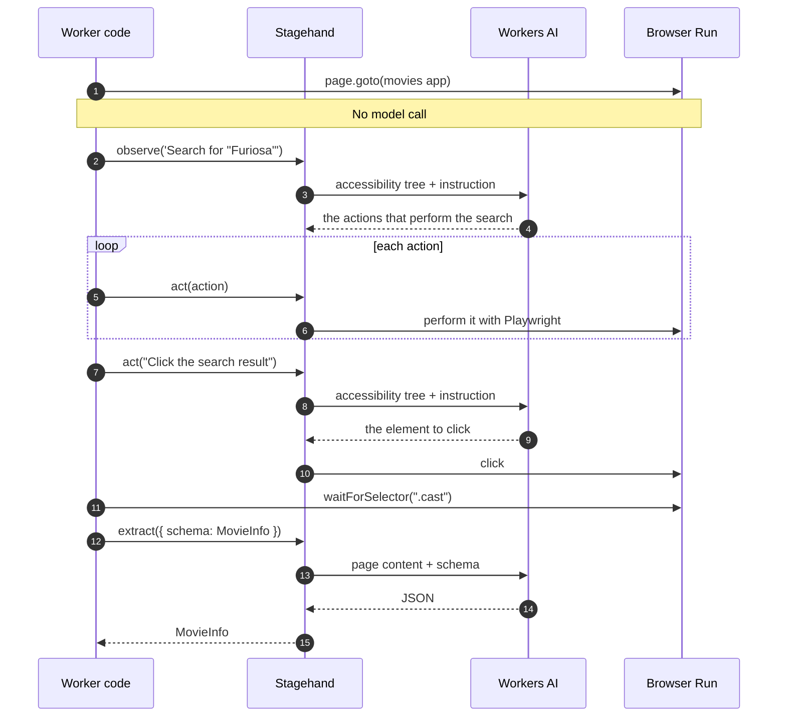
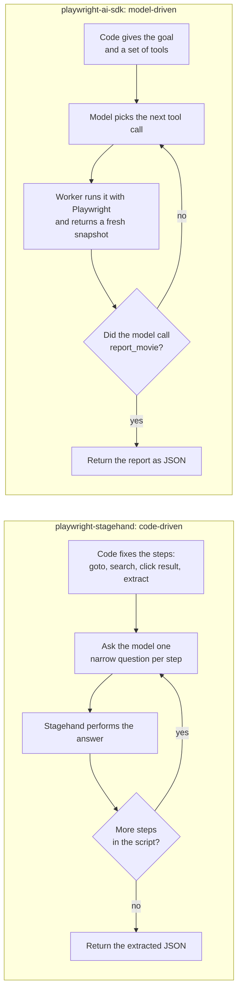

# wrangler-playwright-stagehand

Wrangler app that instructs Stagehand to perform certain actions using Cloudflare Workers AI and Browser Run with Playwright.

### Related Apps

- [wrangler/playwright-anthropic-sdk](../../wrangler/playwright-anthropic-sdk) - Lets Claude drive the browser through its browser toolset instead of scripting Stagehand steps, using the paid Claude API instead of Workers AI.
- [wrangler/playwright-ai-sdk](../../wrangler/playwright-ai-sdk) - Lets the Workers AI model drive the browser through Vercel AI SDK tools instead of scripting Stagehand steps.

## Architecture Diagram

<picture>
  <source media="(prefers-color-scheme: dark)" srcset="./src/assets/arch-diagram-dark.svg">
  
</picture>

## Prerequisites

- **_Cloudflare:_**
  - Must have set the `CLOUDFLARE_API_TOKEN` variable in your local environment, with the `Workers Scripts:Edit` and `Account Settings:Read` permissions.
- **_mise:_**
  - [Install mise](https://mise.jdx.dev/installing-mise.html), which manages Node and pnpm.

## Installation

```sh
mise install
pnpm install
```

## Deployment

```sh
pnpm run deploy
```

## Usage

Open the `workers.dev` URL from the deployment output. The Worker drives a browser through the [Playwright movies demo](https://debs-obrien.github.io/playwright-movies-app/), searches for "Furiosa", opens the result, and returns the extracted movie details as JSON. A run takes around a minute.

If the run fails, the Worker answers `502` with the reason as `{ "error": ... }` and still closes the browser.

## Cleanup

```sh
pnpm wrangler delete
```

## How it works

Stagehand 2.5 drives a Browser Run session over CDP. Browser Run supports only Stagehand 2.5.x, because later versions are not Playwright-based, and Stagehand 2.5 in turn requires Zod 3.

A run, step by step. The code sets the order, and the model answers only within each step:



`src/workersAIClient.ts` answers Stagehand's model calls with Workers AI. Every call carries a Zod schema; the client asks the model for JSON matching it, validates the reply, and retries a malformed one. The default model is `@cf/qwen/qwen3.8-27b`, at low reasoning effort. Any Workers AI model with an OpenAI-compatible chat API and JSON Schema output works; pass `{ model }` to `WorkersAIClient` to change it.

On the Workers Free plan, Browser Run allows 10 minutes of browser time per day and one new browser every 20 seconds. Past either limit, runs fail with a `429` until the allowance resets.

## Code-driven or model-driven

This example scripts the steps and asks the model only how to perform each one. [`wrangler/playwright-ai-sdk`](../../wrangler/playwright-ai-sdk) runs the same task the other way round: the model plans the steps and the Worker carries them out.



| | `playwright-stagehand` | `playwright-ai-sdk` |
| --- | --- | --- |
| Who plans the steps | the code | the model |
| Model calls per run | a few, fixed by the script | one per step, chosen by the model |
| Predictability | same steps on every run | the model can wander or stop early |
| Unexpected pages, such as a cookie banner | the run fails unless the script handles them | the model can deal with them first |
| How the model reaches the browser | Stagehand's own prompts, through `WorkersAIClient` | standard tool calling, through `workers-ai-provider` |
| Structured result | `extract({ schema })` | the `report_movie` tool's schema |
| Dependencies | Stagehand 2.5 and Zod 3, the newest Browser Run supports | current AI SDK and Zod 4 |

Scripted steps suit a fixed, known flow like this one. A model-driven agent suits tasks where the goal is clear but the exact steps aren't. Stagehand 3 supports both styles, but Browser Run supports only Stagehand 2.5.
